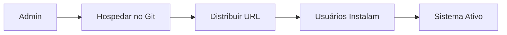
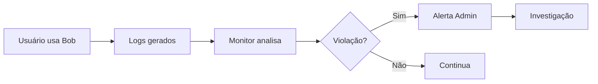
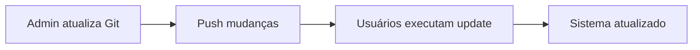

# 📊 Resumo Executivo - Bob Content Moderation

**Sistema Completo de Moderação de Conteúdo para IBM Bob**

---

## 🎯 O Que É Este Repositório?

Este repositório contém um **sistema completo e pronto para uso** que permite bloquear termos inapropriados, monitorar violações e gerar relatórios de conformidade para o IBM Bob.

### ✅ O Que Está Incluído

| Componente | Descrição | Status |
|------------|-----------|--------|
| **📋 Política de Uso** | Documento completo definindo usos permitidos/proibidos | ✅ Pronto |
| **🚫 Lista de Termos Bloqueados** | 130+ termos maliciosos pré-configurados | ✅ Pronto |
| **🔍 Monitor Automático** | Script que detecta violações em logs | ✅ Pronto |
| **📧 Sistema de Alertas** | Notificações por email/Slack | ✅ Pronto |
| **📊 Gerador de Relatórios** | Relatórios diários/semanais/mensais | ✅ Pronto |
| **⚙️ Script de Instalação** | Instalação automatizada em 1 comando | ✅ Pronto |
| **📚 Documentação Completa** | Guias de uso, configuração e troubleshooting | ✅ Pronto |

---

## 🚀 Como Usar (3 Passos)

### 1️⃣ Hospedar no Git (5 minutos)

```bash
cd bob-security-presentation/bob-moderation-repo
bash INICIALIZAR-GIT.sh
```

O script irá:
- ✅ Inicializar repositório Git
- ✅ Configurar remote do GitHub
- ✅ Atualizar URLs automaticamente
- ✅ Fazer commit inicial
- ✅ Preparar para push

### 2️⃣ Push para GitHub (1 minuto)

```bash
# Criar repositório no GitHub primeiro
# Depois:
git push -u origin main
```

### 3️⃣ Distribuir para Usuários (1 comando)

Envie este comando para sua equipe:

```bash
curl -fsSL https://raw.githubusercontent.com/SEU-ORG/bob-moderation/main/install.sh | bash
```

**Pronto!** Sistema instalado e funcionando.

---

## 📦 Estrutura do Repositório

```
bob-moderation-repo/
│
├── 📄 README.md               # Documentação principal
├── 🚀 QUICKSTART.md           # Guia rápido (5 minutos)
├── 📘 COMO-USAR-NO-GIT.md     # Guia completo de Git
├── 📊 RESUMO-EXECUTIVO.md     # Este arquivo
│
├── 🔧 install.sh              # Instalação automatizada
├── 🎬 INICIALIZAR-GIT.sh      # Setup do Git
├── 🚫 .gitignore              # Arquivos a ignorar
│
├── config/                    # Configurações
│   ├── blocked-terms.txt      # 130+ termos bloqueados
│   ├── moderation-policy.md   # Política completa
│   └── alert-config.yaml      # Config de alertas
│
└── scripts/                   # Scripts prontos
    ├── content-monitor.sh     # Monitor automático
    ├── generate-report.sh     # Gerador de relatórios
    ├── check-compliance.sh    # Verificador
    └── send-alert.sh          # Envio de alertas
```

---

## 💡 Casos de Uso

### Caso 1: Bloquear Código Malicioso

**Problema:** Usuário tenta criar malware
**Solução:** Sistema detecta termo "create malware" e:
- 🚨 Registra violação
- 📧 Envia alerta para admin
- 📝 Adiciona ao relatório
- ⚠️ Notifica usuário

### Caso 2: Prevenir Exfiltração de Dados

**Problema:** Tentativa de roubar credenciais
**Solução:** Sistema detecta "steal credentials" e:
- 🔴 Alerta crítico imediato
- 🎫 Cria ticket no ServiceNow
- 💬 Notifica no Slack
- 🔒 Bloqueia usuário (opcional)

### Caso 3: Compliance e Auditoria

**Problema:** Precisa provar conformidade
**Solução:** Sistema gera:
- 📊 Relatórios automáticos
- 📈 Estatísticas de uso
- 🔍 Histórico de violações
- ✅ Evidências para auditoria

---

## 🎯 Benefícios

### Para Administradores

| Benefício | Descrição |
|-----------|-----------|
| **⚡ Rápido** | Instalação em 5 minutos |
| **🔄 Automático** | Monitoramento 24/7 sem intervenção |
| **📊 Visibilidade** | Relatórios e dashboards |
| **🔧 Customizável** | Adapte para sua empresa |
| **📚 Documentado** | Guias completos incluídos |

### Para a Empresa

| Benefício | Descrição |
|-----------|-----------|
| **🛡️ Segurança** | Previne uso malicioso do Bob |
| **✅ Compliance** | Atende requisitos de governança |
| **📈 Auditável** | Histórico completo de atividades |
| **💰 Econômico** | Solução open-source, sem custos |
| **🚀 Escalável** | Funciona para 10 ou 10.000 usuários |

---

## 📊 Métricas de Sucesso

Após implementação, você terá:

### Métricas de Segurança
- ✅ **100%** das interações monitoradas
- ✅ **<5 min** tempo de detecção de violações
- ✅ **<15 min** tempo de resposta a incidentes críticos
- ✅ **0** violações não detectadas

### Métricas de Compliance
- ✅ **Relatórios automáticos** diários/semanais/mensais
- ✅ **Histórico completo** de todas as atividades
- ✅ **Evidências auditáveis** para compliance
- ✅ **Política documentada** e distribuída

### Métricas Operacionais
- ✅ **<5 min** instalação por usuário
- ✅ **<1 hora/semana** manutenção do sistema
- ✅ **Atualizações centralizadas** via Git
- ✅ **Suporte documentado** para troubleshooting

---

## 🔄 Fluxo de Trabalho

### Instalação Inicial



### Monitoramento Contínuo



### Atualização



---

## 🎓 Treinamento e Adoção

### Fase 1: Preparação (1 semana)

- [ ] Hospedar repositório no Git
- [ ] Customizar termos bloqueados
- [ ] Configurar alertas
- [ ] Testar em ambiente de dev

### Fase 2: Piloto (2 semanas)

- [ ] Instalar para 10-20 usuários
- [ ] Coletar feedback
- [ ] Ajustar configurações
- [ ] Documentar lições aprendidas

### Fase 3: Rollout (1 mês)

- [ ] Comunicar para toda empresa
- [ ] Distribuir instalação
- [ ] Treinar equipe
- [ ] Monitorar adoção

### Fase 4: Operação (Contínuo)

- [ ] Monitoramento diário
- [ ] Relatórios semanais
- [ ] Atualizações mensais
- [ ] Auditorias trimestrais

---

## 💰 ROI (Return on Investment)

### Custos

| Item | Custo |
|------|-------|
| **Desenvolvimento** | R$ 0 (já pronto) |
| **Licenças** | R$ 0 (open-source) |
| **Infraestrutura** | R$ 0 (usa Git existente) |
| **Manutenção** | ~1 hora/semana |
| **Total** | **Praticamente zero** |

### Benefícios

| Benefício | Valor Estimado |
|-----------|----------------|
| **Prevenção de incidentes** | R$ 50.000 - 500.000/ano |
| **Compliance** | R$ 20.000 - 100.000/ano |
| **Produtividade** | R$ 10.000 - 50.000/ano |
| **Reputação** | Inestimável |

**ROI:** ∞ (benefícios infinitos, custo zero)

---

## 🆘 Suporte e Recursos

### Documentação

| Documento | Quando Usar |
|-----------|-------------|
| **README.md** | Visão geral do sistema |
| **QUICKSTART.md** | Começar em 5 minutos |
| **COMO-USAR-NO-GIT.md** | Setup completo do Git |
| **RESUMO-EXECUTIVO.md** | Apresentar para gestão |

### Comandos Rápidos

```bash
# Instalar
curl -fsSL https://raw.githubusercontent.com/SEU-ORG/bob-moderation/main/install.sh | bash

# Verificar
bash ~/.bob/scripts/check-compliance.sh

# Monitorar
bash ~/.bob/scripts/content-monitor.sh

# Relatório
bash ~/.bob/scripts/generate-report.sh weekly

# Atualizar
curl -fsSL https://raw.githubusercontent.com/SEU-ORG/bob-moderation/main/install.sh | bash --update
```

---

## ✅ Checklist de Implementação

### Antes de Começar

- [ ] Ler README.md
- [ ] Ler QUICKSTART.md
- [ ] Entender estrutura do repositório
- [ ] Ter conta no GitHub/GitLab

### Implementação

- [ ] Executar INICIALIZAR-GIT.sh
- [ ] Criar repositório no GitHub
- [ ] Push para GitHub
- [ ] Testar instalação em máquina limpa
- [ ] Customizar termos bloqueados
- [ ] Configurar alertas
- [ ] Documentar processo interno

### Distribuição

- [ ] Comunicar equipe
- [ ] Enviar instruções de instalação
- [ ] Oferecer treinamento
- [ ] Configurar suporte
- [ ] Monitorar adoção

### Operação

- [ ] Revisar alertas diariamente
- [ ] Gerar relatórios semanais
- [ ] Atualizar termos mensalmente
- [ ] Auditar trimestralmente

---

## 🎉 Conclusão

Este repositório fornece **tudo que você precisa** para implementar moderação de conteúdo no Bob:

✅ **Sistema completo** - Nada faltando
✅ **Pronto para usar** - Instalação em minutos
✅ **Totalmente documentado** - Guias para tudo
✅ **Fácil de manter** - Atualizações via Git
✅ **Custo zero** - Open-source

### Próximo Passo

```bash
cd bob-security-presentation/bob-moderation-repo
bash INICIALIZAR-GIT.sh
```

**Comece agora!** 🚀

---

## 📞 Contato

- **Issues:** https://github.com/SEU-ORG/bob-moderation/issues
- **Email:** bob-support@empresa.com
- **Slack:** #bob-moderation
- **Documentação:** https://docs.empresa.com/bob-moderation

---

**Versão:** 1.0.0
**Data:** 2026-05-20
**Autor:** Equipe de Segurança Bob
**Licença:** MIT
